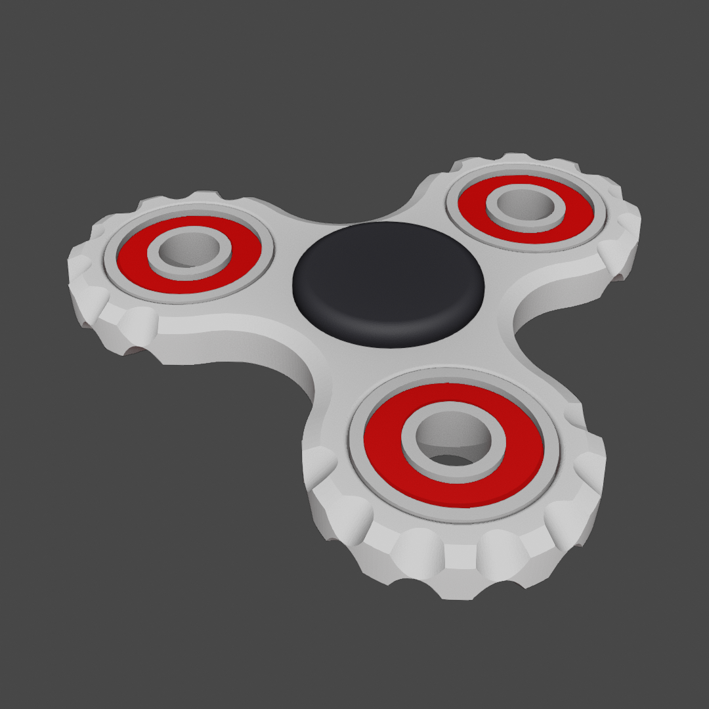

# Fidget Spinner

- Download from Printables here: [`Download Link`](https://www.printables.com/@EvokeMadness_492935)
- Download from Thingiverse here: [`Download Link`](https://www.thingiverse.com/EvokeMadness/designs)

## Summary

A fidget spinner with a satisfying divot shape around each weight.

* * *

## Summary

Three files are available to download:

- Fidget Spinner body
- Fidget Spinner handle
- Blank Fidget Spinner and corresponding negative volume

# Print Settings

- Supports: None
- Infill: 15%
- Brim: false

# Bill of Materials

- Four 608 skateboard bearings
- Permanent adhesive

# Assembly

- **Assembling the main body**
	- Coat the outside circumference of each bearing with glue, and slide each bearing into one of the four holes on the main body.

- **Assembling the handle**
	- Insert the F side handle into the center bearing, and apply glue into the center hole.
	- Insert the M side handle into the center bearing, using the hexagonal peg to orient the part.

# Additional Information

- **Notes**
	- Assembly is optional. Parts may join without glue; or only without glue depending on the dimensional accuracy of the print.
	- You may be able to replace the bearings used as weights with something different, so I've included a blank fidget spinner body intended to be used with `negative-volume.stl`

- **Troubleshooting**
	- In the case that the tolerances for the bearing hole diameters need to be adjusted, follow these steps:
		1. Load `body-blank.stl`
		2. Add `negative-volume.stl` as a negative volume, to the object.
		3. Split `negative-volume.stl` into parts.
		4. Adjust `Size [World]:` located under `Part manipulation` for each part to the desired diameter. If you do not see this option, ensure the PrusaSlicer mode is either Normal or Expert.

# A Note from the Designer

Hi! Thanks for checking out my model! This fidget spinner is an improvement on one of my first 3D models and prints. It was inspired by the [*Cog Triple Spinner*](https://www.thingiverse.com/thing:1805719) by LoveWaffle. If you've printed and assembled this design, I'd love to see it. As always, if you have any issues with the original model, please let me know, and you can even open an issue on this model's [GitHub](https://github.com/EvokeMadness/fidget-spinner) page.

* * *

# Preview

